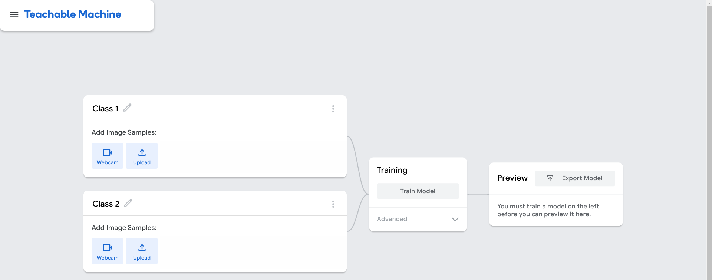
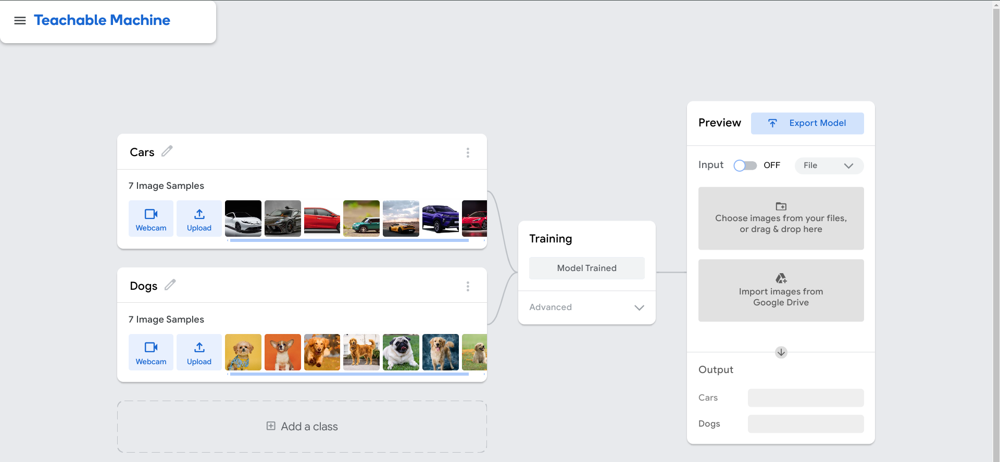
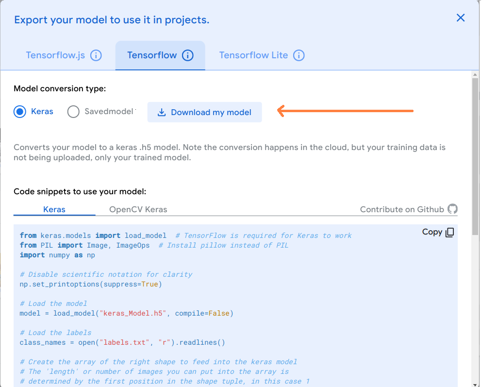

README
======

THINGS YOU NEED TO DO FIRST TO RUN THIS WEBAPP
----------------------------------------------

You need to create ``virtual environment``(Python 3.10 version is required to run this app):

    python -m venv venv

### Activate your venv:
PowerShell: 
    
    .\venv\Scripts\activate

--------------------------------
    
CMD: 

    venv\Scripts\activate

---------------------------------

Linux terminal: 

    source venv/bin/activate

---

Install the packages in ``requirements.txt`` file:

    pip install -r requirements.txt

### ****TEACHABLE MACHINE**** 

* #### Name these classes and upload your images with category(e.g. Cats, Cars, Dogs, etc.)

#### * Export model and download it. Copy the downloaded two files(keras_model.h5 and labels.txt) and replace them with mine.

